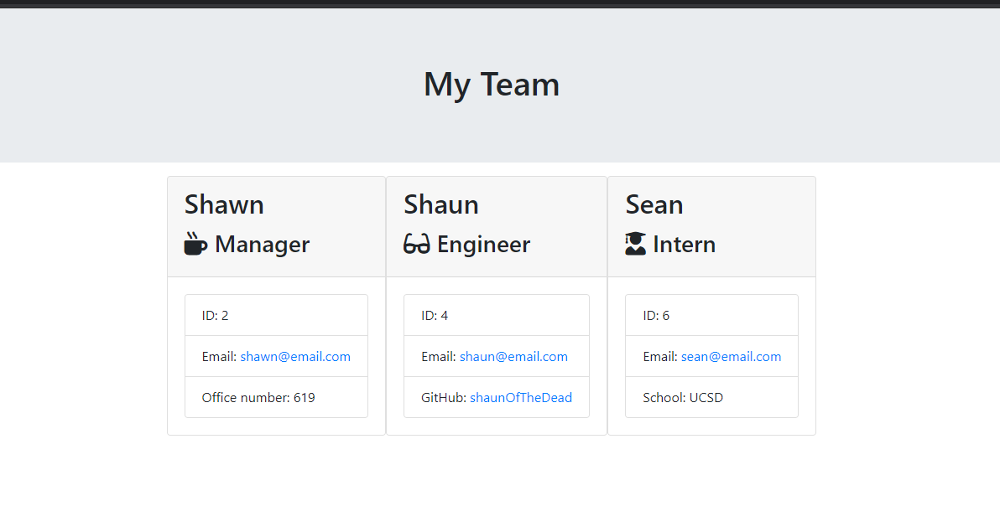
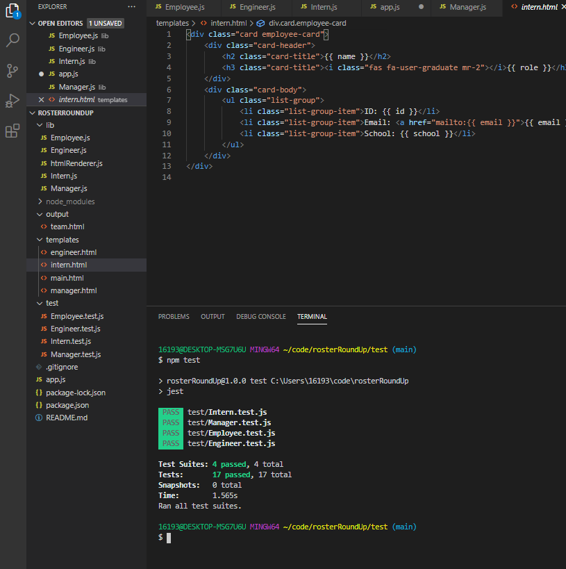

# rosterRoundUp
App for Oraganizing a project Roster

# ROSTER ROUNDUP

## Description

Application allows User to use the CLI to generate an HTML page that displays information about their team. Information is gathered through a series of Prompts using Inquirer module.

## Installation

Clone repo, Here. [dohmr / rosterRoundUp Repo](https://github.com/dohmr/rosterRoundUp)

Open via Code Editor. 

## Usage

Install npm dependencies. Run file ```node app.js``` in terminal.
Follow prompts. At completion, an HTML file is created within output folder, generating HTML with your input information via Inquirer.

## Screens

Final render of EXAMPLE html:



Testing:



Link to a Walk-through , here : [App. Walk-Through](https://drive.google.com/file/d/1lC8lBn6KWqsFPNQgw9M6sbeoEKWqDI5J/view?usp=sharing)

## Questions

[Shawn Yandall : LinkedIn](https://www.linkedin.com/in/shawn.yandall/)

[Shawn Yandall : Github](https://github.com/dohmr/)
